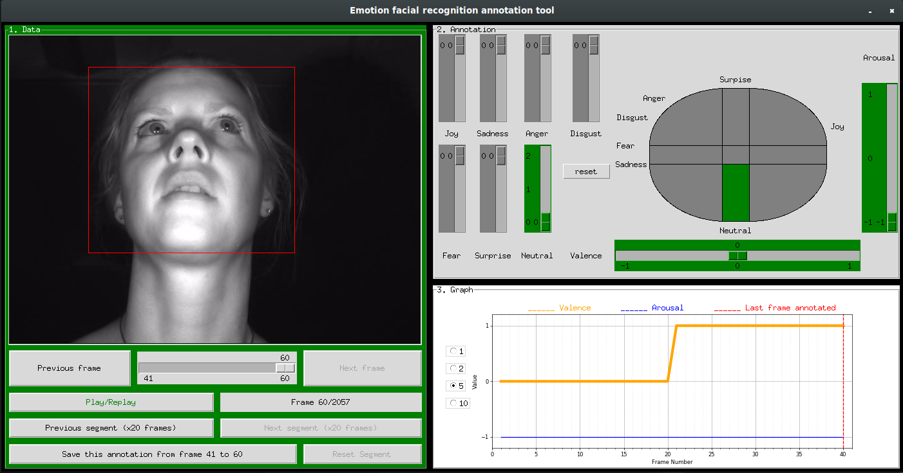

README to know how to use well this Emotion Recognition Annotation Tool.

1. Load data:
	
	Put the smb files in the data/files/ folder of the tool repository

2. Requirements:

	You need to use Python3 and have the following python libraries installed:
		- matplotlib
		- tkinter
		- cv2
		- csv
		- numpy
	

3. Start the application:
	
	Type "python3 main.py" in the lts5-ada-me folder and tap enter
	

4. Choose a file:

	1) Choose a .smb file to annotate the corresponding video and clic on validate.

	2) The file will likely be too big. The terminal will display a message asking you to choose which part of the file you want to annotate. You have to type a number (1 for first part, 2 for second part, etc...) and tap enter.

5. Annotation Task

	1) Play the video for the 5 frames

	If either the emotion isn't the same in the 5 frames segments or some frames are not valid (we can't identify correctly the face on the screen), please annotate frame by frame (using the next and previous frame buttons)

	2) If a frame isn't valid, click on "Not valid", all values will be set to -999

	Otherwise, annotate the valence and arousal with the corresponding assumptions:
	
	Valence: {-1: Negative, 0: Neutral, 1: Positive}

	Arousal: {-1: asleep, 0: Normal, 1: Explosive}

	Below is the graph associated which may help you to annotate correctly.

[1]  A. Mollahosseini, B. Hasani and M. H. Mahoor, "AffectNet: A Database for Facial Expression, Valence, and Arousal Computing in the Wild", p2 fig1

	3) Annotate the severity with the corresponding assumptions:

	Severity: {1: Neutral, 2: Positive, 3: Frustrated, 4; Anxiety}

	There are 9 parts in the graph, for 6 of them, the severity is set automatically.

	The tree others:
		1) valence = 0 and arousal = 1, you have the choice between neutral and positive
		
		2) valence = -1 and arousal = -1, you have the choice between neutral and anxiety. Just notice that if the driver looks bored or tired, please annotate the severity as 1 (neutral). If the driver looks sad, depressed or anxious, please annotate the severity as 4 (anxiety)

		3) valence = -1 and arousal = 0, you have the choice between frustrated and anxiety. Below, there are two images which can help you to distinguish the two. The first one is frustration and the second one is anxiety.

	4) If you recognize one of the seven basics emotion, set the value to one with the corresponding slide bar.

	5) When the segment is finished, click on the save Button and then on Next Segment and restart the process

	IMPORTANT: If you want to annotate frame by frame, you have to save your annotation for the first frame before set a new annotation for the next one. Look at the save Button which will inform you which frame or group of frame you're annotating.

	
	6) Finally there is a graph which plots the saved annotations you've done for valence and arousal. It could help you to follow the trend of an emotion and find the correct annotation based on the previous ones

	7) When you've annotated al frames, click on the Save all and exit button which will replace the next Segment Button

6. Fetch annotated data:

	All annotated data is in the data/files folder

	They are .csv files with the same name as file input followed by _annotated
		
