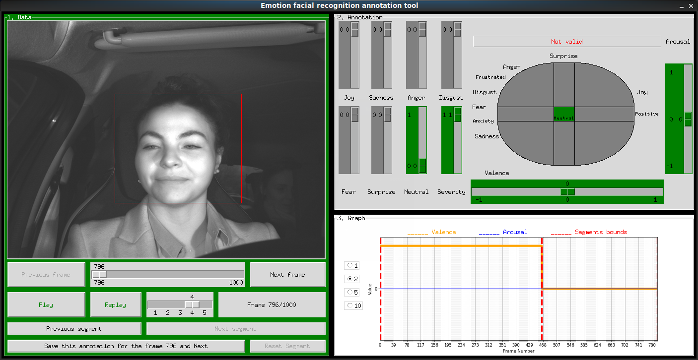

README to know how to use well this Emotion Recognition Annotation Tool.

1. Load data:
	
	For now, you can:

	a)
		Put your data files in the data/files/ folder.

	b)
		Put your data in a hard drive disk

	c)
		Don't load data, you want to access them on NAS server

	Requirements: The data files have to be .csv files or .smb ones. For a csv file, you must import the associated video file (.avi only) beside.

2. Requirements:

	You need to have the following python libraries installed:
		- matplotlib
		- tkinter
		- cv2
		- csv
		- numpy

	You need to know that to access on the NAS server, the program will mount the server on /mnt/NAS folder in the repository:
	
		1)	You need to install curlftpfs for linux (sudo apt install curlftpfs)
		
		2)	You need to create the /mnt/NAS directory (sudo mkdir /mnt/server)
	

3. Start the application:
	
	On linux, type in the terminal in lts5-ada-me folder: python3 main.py \ 
	
	While starting, the termial will ask you how you want to access the data:
	
		1)	With NAS server (You need to use EPFL wifi or connect to the EPFL VPN). Your access username and password will be asked. Also, to mount the server, the program has to run a terminal command with sudo. You have to type your linux password if you want to continue)
		
		2)	With a hard drive disk (You need to provide your linux username and your hard drive disk name. Also, you can provide a path to follow in your hard drive disk (Enter if you want to skip this step)
		
		3)	On your local repository in the data/files/ folder

	The best to do is to load data on a hard drive disk since the data is heavy. Run the program on the NAS server is very slow.

	Once you've finished this step, a window with a list of folders will be displayed.

4. Choose a file:

	Choose a .smb or a .cvs file to annotate the corresponding video and clic on validate.

	Your can exit this window at any moment.

5. Annotate:
	
	First, annotate the valence and arousal with help of the graph that shows you the previous segments annotated.
	
	Valence: {-1: Negative, 0: Neutral, 1: Positive}

	Arousal: {-1: asleep, 0: Normal, 1: Explosive}

	
	Then, you can annotate the corresponding emotions to have more precision.

	Don't forget to annotate the severity with the following asumption : {1: Neutral, 2: Positive, 3: Frustration, 4; Anxiety}.
	
	Have a look to the save button, it will inform you which segment you're annotating. To choose the segment, use the slide bar.

	You always have to save an entire segment before go to the next one.
	
	In this version you can't quit the application and continue your current annotation later. You have to annotate all before Save All and Quit.

	Some informations you need to know to handle the data are:

		1)	There is a slide bar with values 1, 2, 3, 4, 5 on the data panel. You can set the speed of the video with it. 1 for very slow and 5 for fast
		2)	The radioButtons on the graph correspond to the number of previous segment annotated you want to show
		3)	When you're saving an annotation and the difference between the current frame and the starting frame is greater than 20, the video segment is cut at the current frame.

6. Fetch annotated data:

	All annotated data is in the data/annotated folder.

	They are .csv files with the same name as file input followed by annotated

	If you've annotated on a hard drive, a .csv file has been saved on the same location of the initial file.

	If you've annotated on the NAS server, a .csv file has been saved on your /home/ directory on the server.
		
